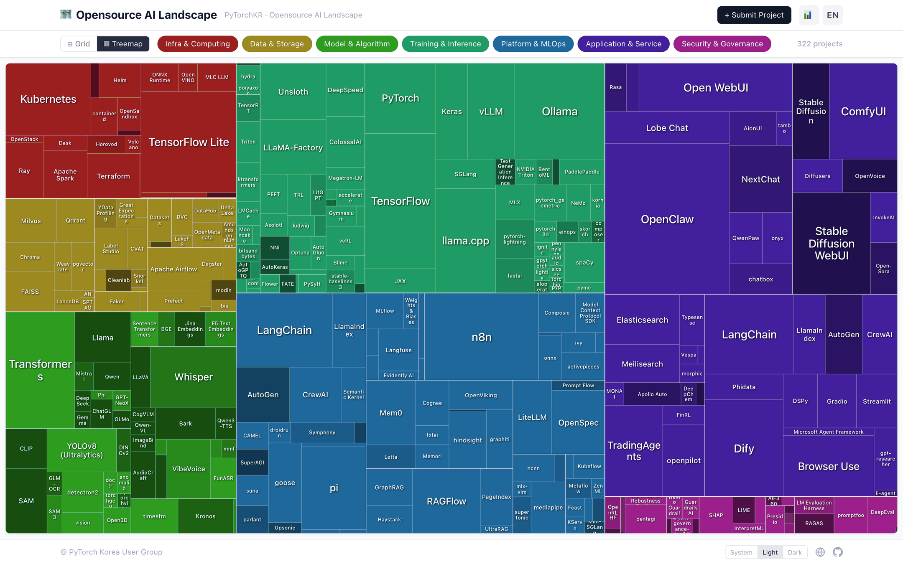

# Opensource AI Landscape

🗺️ **https://landscape.pytorch.kr**

[](https://landscape.pytorch.kr)

## 소개

Opensource AI Landscape는 AI와 관련된 오픈소스 프로젝트를 한눈에 살펴볼 수 있는 인터랙티브 시각화 도구입니다.
이 프로젝트는 [AI Techmap](https://www.youtube.com/watch?v=z2Ge2QAEWbY)을 기반으로 구성되었으며, [Newsmap](https://www.google.com/search?num=10&newwindow=1&udm=2&q=newsmap)으로부터 영감을 받았습니다.

## 주요 기능

- **Treemap/Grid View**: 7개 모듈(인프라, 데이터, 모델, 학습/추론, 플랫폼, 응용, 보안) 기준으로 프로젝트를 시각화
- **전체 / 글로벌 / 국내 탭**: 국내 기업·기관 프로젝트(`region: "KR"`)를 따로 보거나 함께 봄. 전체 탭에서는 국내 프로젝트에 노란 테두리와 KR 배지를 달고, `국내 강조`를 켜면 나머지를 흐리게 함. `?scope=kr`처럼 탭을 링크로 공유할 수 있음
- **Module Filter**: 관심 있는 모듈만 선택하여 볼 수 있음
- **GitHub Stars based size**: 프로젝트 인지도를 직관적으로 파악
- **Commit time based color**: 최근 활발한 프로젝트를 한눈에 확인
- **Multi-language**: 한국어 / English 지원

## 프로젝트 추가 요청

AI 관련 오픈소스 프로젝트를 추가하고 싶으시다면, [프로젝트 추가 요청 이슈](https://github.com/PyTorchKR/landscape/issues/new?template=add-project.yml)를 생성해 주세요.
저장소 URL, 모듈, 카테고리를 선택하면 관리자가 검토한 뒤 아래 명령어로 등재합니다.

## 관리자 명령어

`add-project` 라벨이 붙은 이슈에 저장소 OWNER / MEMBER / COLLABORATOR가 댓글을 남기면 동작합니다.
명령어는 **댓글의 첫 줄 맨 앞**에 있어야 하며, 본문 중간에 언급된 `/approve`는 무시됩니다.

| 명령어 | 동작 |
|---|---|
| `/approve` | 이슈 본문의 저장소 URL, 모듈, 카테고리 그대로 등재 |
| `/approve <moduleId> <categoryId>` | 저장소 URL은 이슈 본문에서 읽고, 분류만 지정한 값으로 바꿔 등재 |
| `/approve <owner/repo> <moduleId> <categoryId>` | 저장소와 분류를 모두 지정해 등재 (이슈 본문 형식과 무관) |

```text
/approve
/approve platform-mlops memory-knowledge
/approve getzep/graphiti platform-mlops memory-knowledge
```

명령이 성공하면 다음 순서로 처리됩니다.

1. GitHub API로 저장소 정보(Stars, 라이선스, 최근 커밋 등)를 조회해 `data/tools/<moduleId>/tools.json`과 `data/categories/index.json`에 추가
   - HuggingFace에만 공개된 모델·데이터셋·컬렉션은 저장소 URL 자리에 HuggingFace URL을 넣으면 됩니다. 이때는 Stars 대신 Likes와 Downloads를 저장합니다. 모델·데이터셋은 HuggingFace에 짧은 설명 필드가 없어 이슈의 설명이 필요합니다. `/approve <owner/repo> ...` 형식은 GitHub 저장소에만 쓸 수 있습니다.
   - 관리자가 이슈에 `Korea` 라벨을 붙이면 `region: "KR"`을 함께 저장해 국내 탭에 표시합니다.
2. `main`에 커밋 (`feat: add <url> (closes #N)`)
3. 이슈에 결과 댓글을 남기고 이슈를 닫음
4. Build & Deploy를 실행해 사이트에 바로 반영

실패하면 이슈에 워크플로 로그 링크가 달립니다. 흔한 원인은 이미 등록된 프로젝트, 모듈과 카테고리 불일치, 비공개 또는 존재하지 않는 저장소입니다.
모듈 ID와 카테고리 ID는 [`data/modules/index.json`](data/modules/index.json), [`data/categories/index.json`](data/categories/index.json)에서 확인할 수 있습니다.

### 사이트 다시 빌드하기

Build & Deploy는 `main`에 push될 때와 매일 KST 03:00에 자동 실행되며, 이때 모든 프로젝트의 Stars 정보도 갱신합니다.
수동으로 실행하려면 Actions 탭에서 **Build & Deploy → Run workflow**를 누르거나 다음 명령을 사용합니다.

```bash
gh workflow run daily-update.yml -R PyTorchKR/landscape
```

## 개발 및 기여

[pnpm](https://pnpm.io) 9.15.9를 사용합니다(`package.json`의 `packageManager`). Node.js 22 이상과 Corepack을 권장합니다.

```bash
corepack enable
pnpm install
pnpm dev
```

| 명령어 | 설명 |
|---|---|
| `pnpm dev` | 로컬 개발 서버 실행 |
| `pnpm build` | 타입 검사 후 `dist/`로 프로덕션 빌드 |
| `pnpm preview` | 빌드 결과 미리보기 |
| `GITHUB_TOKEN=... pnpm update-stars` | 등록된 모든 프로젝트의 Stars, Forks, 최근 커밋 정보 갱신 (HuggingFace 항목은 Likes, Downloads) |
| `GITHUB_TOKEN=... pnpm add-tool -- --github-url <url> --module-id <id> --category-id <id> [--description <text>] [--region KR]` | 프로젝트 1개를 로컬에서 직접 추가 (`/approve`가 내부적으로 사용). `<url>`은 GitHub 또는 HuggingFace URL |

### 데이터 구조

```text
data/
├── modules/index.json        # 7개 모듈과 모듈별 카테고리 목록
├── categories/index.json     # 카테고리 정의와 카테고리별 프로젝트 ID 목록
└── tools/<moduleId>/tools.json  # 모듈별 프로젝트 데이터
```

## 라이선스

[MIT](LICENSE)
